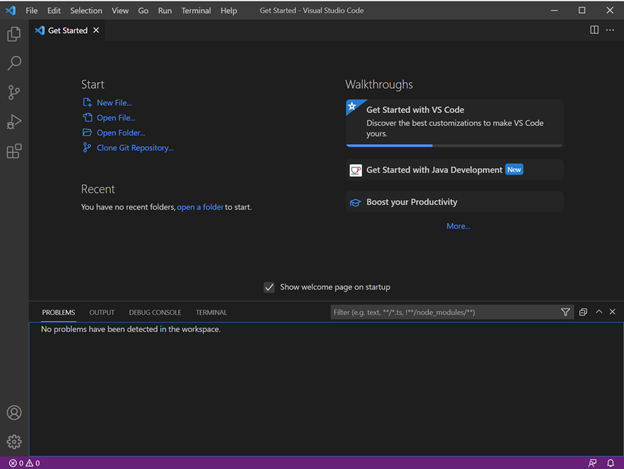

# **Lab Report #1**
## 14th Jan 2021

## **Part 1: Installing VSCode**
You can download Visual Studio Code by going to [this link](https://code.visualstudio.com/download) and downloading the appropriate version for your operating system. 

Open the downloaded .exe file and follow the given instructions to download VSCode. Now, you are set with VSCode! When you open it, it will probably look like this (or slightly different depending on your OS): 

## **Part 2: Remotely Connecting**
Now, comes the more interesting part. First, if you are using a Windows machine, make sure to install [OpenSSH](https://docs.microsoft.com/en-us/windows-server/administration/openssh/openssh_install_firstuse). Next, find your course-specific account for CSE 15L over [here](https://sdacs.ucsd.edu/~icc/index.php). 

Now head over to VSCode and open the terminal within it. And type the following command: `ssh <account>@ieng6.ucsd.edu`. If it's your first time doing this, you may get the following message. 

You can just type 'yes' and proceed. Next, type in your password and press enter. Note that as you type in your password nothing will appear on your terminal. This is normal! Your keyboard didn't suddenly stop working. The characters are simply not visible. Your terminal will now look something like this: 

You are now a client connected to the UCSD ieng6 servers. Everything you type on this terminal is being run on those servers. Congratulations!