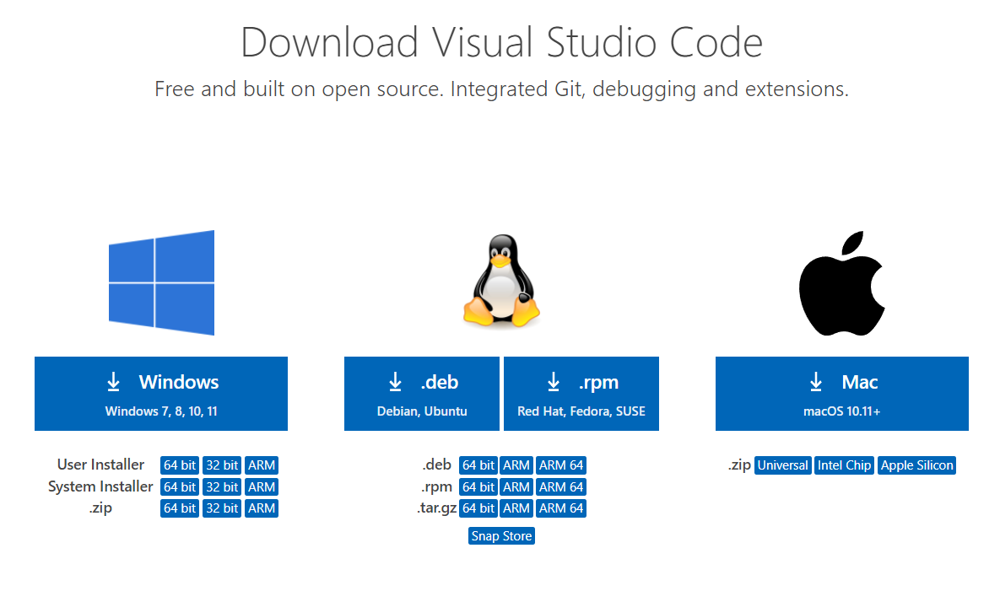
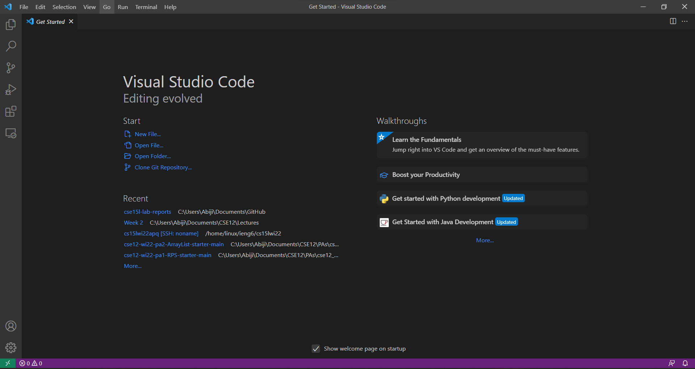
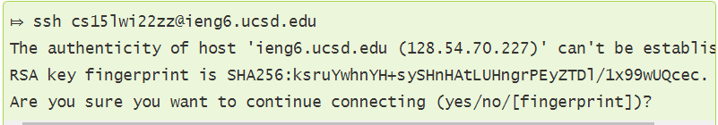
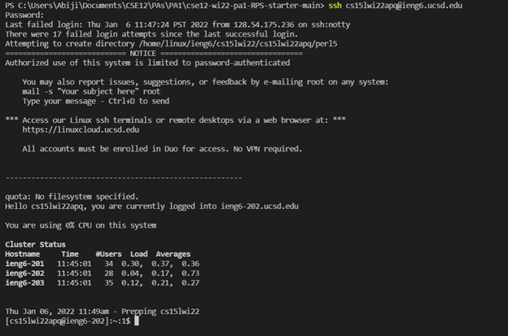
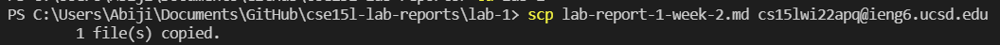
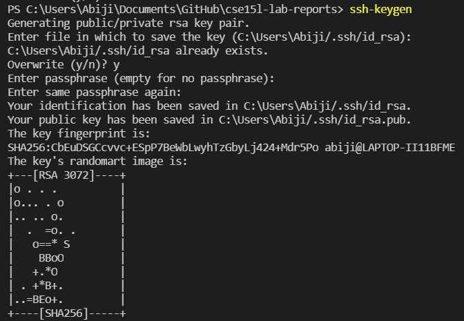
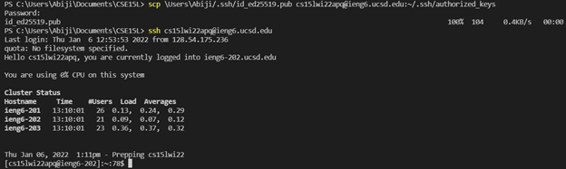
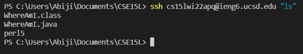
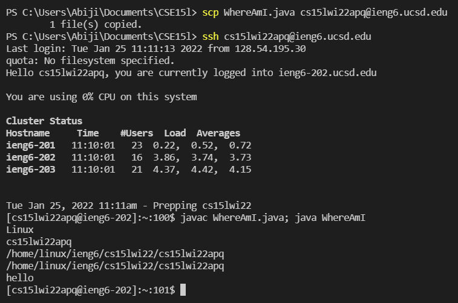

# **Lab Report #1**
## 14th Jan 2021

## **Part 1: Installing VSCode**
You can download Visual Studio Code by going to [this link](https://code.visualstudio.com/download) and downloading the appropriate version for your operating system. 

Open the downloaded .exe file and follow the given instructions to download VSCode. Now, you are set with VSCode! When you open it, it will probably look like this (or slightly different depending on your OS): 

---
## **Part 2: Remotely Connecting**
Now, comes the more interesting part. First, if you are using a Windows machine, make sure to install [OpenSSH](https://docs.microsoft.com/en-us/windows-server/administration/openssh/openssh_install_firstuse). Next, find your course-specific account for CSE 15L over [here](https://sdacs.ucsd.edu/~icc/index.php). 

Now head over to VSCode and open the terminal within it. And type the following command: `ssh <account>@ieng6.ucsd.edu`. If it's your first time doing this, you may get the following message. 

You can just type `yes` and proceed. Next, type in your password and press enter. Note that as you type in your password nothing will appear on your terminal. This is normal! Your keyboard didn't suddenly stop working. The characters are simply not visible. Your terminal will now look something like this: 

You are now a client connected to the UCSD ieng6 servers. Everything you type on this terminal is being run on those servers. Congratulations!

---
## **Part 3: Trying Some Commands**
Now, how do you navigate this terminal? There are several commands to help you do so. Some of them are listed below. 

* `cd [insert directory path]` - stands for "change directory." As the name implies it will change your current directory. 
*  `ls` - shows the "non-hidden" files in your current directory. Example: 
* `ls -a` - shows all files in your current directory

There are many other commands as well. But these will help you start navigating around the terminal. 

---
## **Part 4: Moving Files With `scp`**
Now it's nice that we can use this server. But there is almost no point (in our case) if we can't run our files on the ieng6 servers. That's were the `scp` command comes in. It allows us to copy files from the client (your computer) to the servers. You format your command like: 

`scp [file name] [server]`. 

This is demonstrated below.

)

---
## **Part 5: Setting a SSH Key**
You have probably realised by now, that you are requiried to type in your password every single time you call `ssh`. This can be very time-consuming. This part of the tutorial exists so that you no longer will have to repeatedly type your password. Let's set a SSH key. First you need to use the `ssh-keygen` command to generate a private and public key. If you have a Windows machine, follow some extra steps about `ssh-add` over [here](https://docs.microsoft.com/en-us/windows-server/administration/openssh/openssh_keymanagement#user-key-generation). 

Now, you need to copy the public key into the server's `.ssh` using `scp`. And voila! You should no longer require your password to access the server with `ssh`. 

---
## **Part 6: Optimizing Remote Running**
This section aims to highlight a couple of ways to make remote running more efficient and easier. For example, while running the command on your client if you place further commands at the end in quotes, you won't have to enter the server. You will log in, run the command, and log out automatically. This is showcased below. 

Another way to optimize your terminal usage is to use semicolons to run multiple commands in one line. Moreover, most terminals allow you to use the up arrow on your keyboard to recall previous commands. 

By particularly using these two commands I was able to optimize my saving and run time to from more than 20 keystrokes to around 4-5 keystrokes or mouse clicks. By simply using the up arrow, I was able to recall previous commands. Additionally, I used a semicolon to combine `javac WhereAmI.java; java WhereAmI` into one line, saving atleast one more keystroke. A screenshot of this process is shown below. 

Thus, this wraps up your SSH tutorial and introduction to remote running. Hopefully you were successful. 
