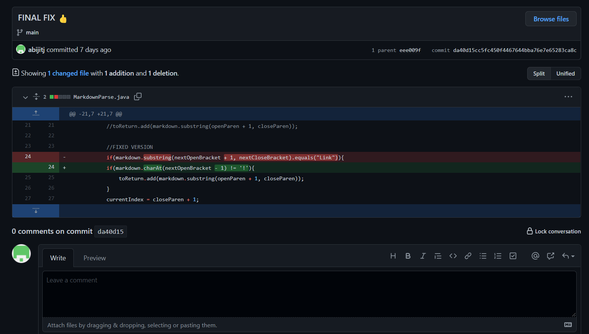
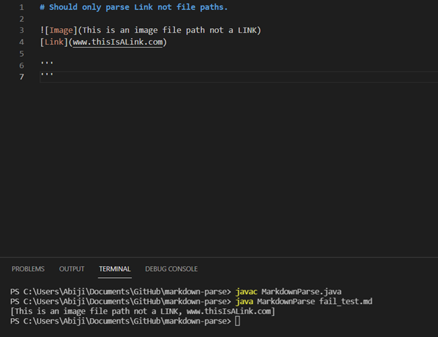

# **Lab Report #2**
## 28th Jan 2021

[List of all Lab Reports](https://abijitj.github.io/cse15l-lab-reports/)

#  Error #1: 
## Logical Error: Parser shouldn't parse image files

Link to failing md file -> [Failing test case](https://github.com/abijitj/markdown-parse/blob/main/fail_test.md)

Symptom of error: 

The symptom of this error was that the output showed something that was not a link. In this case, it was because the syntax for including an image was very similar to a hyperlink. The only difference being an exclamation mark appearing before the `[` in the markdown file for images. Therefore, the bug in our program was that it did not differentiate between images and links. We fixed this by adding an if statement differentiating by the exclamation mark.   

# Error #2: 

# Error #3