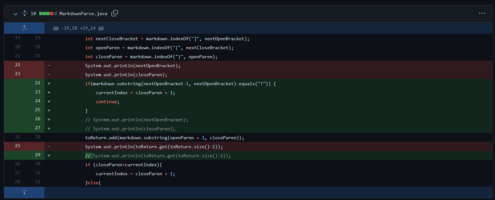

# **Lab Report #2**
## 28th Jan 2022

[List of all Lab Reports](https://abijitj.github.io/cse15l-lab-reports/)

Lab Report #2 Instructions -> [Here](https://ucsd-cse15l-w22.github.io/week/week4/#week-4-lab-report)

#  Error #1: 
## Logical Error: Parser shouldn't parse image files

Link to failing md file -> [Failing test case](https://github.com/abijitj/markdown-parse/blob/main/fail_test.md)

Symptom of error: 

The symptom of this error was that the output showed something that was not a link. In this case, it was because the syntax for including an image was very similar to a hyperlink. The only difference being an exclamation mark appearing before the `[` in the markdown file for images. Therefore, the bug in our program was that it did not differentiate between images and links. We fixed this by adding an if statement differentiating by the exclamation mark.   

# Error #2: 
## Technical Error: Infinite Loop when the file does not end with `]`

Link to failing md file -> [Failing test case](https://github.com/abijitj/markdown-parse/blob/main/test.md)

Symptom of error: 

The symptom of this error was that the program took exceedingly long to run and in the end resulted in a `java.lang.OutOfMemoryError`. This is often a sign of an infinite loop, which in this case was the bug because we didn't account for the file not ending in a `]` leading to the while loop infinitely running. 

# Error #3
## Technical Error: Typo leading to IndexOutOfBounds exception.

Link to failing md file -> [Failing test case](https://github.com/abijitj/markdown-parse/blob/main/test-file-3.md)

Symptom of error: 

In this scenario, the output caused an `IndexOutOfBoundsException`. In this case, the bug was that our program didn't account for a file that didn't contain any links or in other words, it didn't contain `` syntax. Therefore, the `indexOf` method would return -1, causing an `IndexOutOfBoundsException`. 

Thank you for reading.