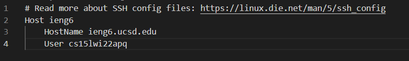
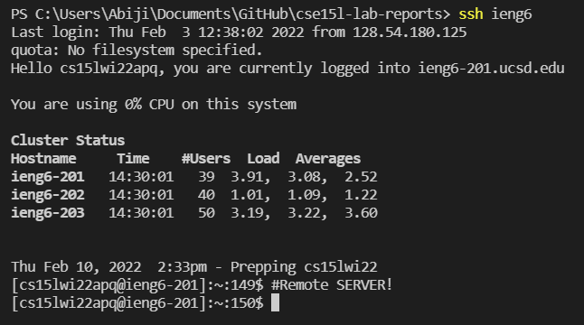
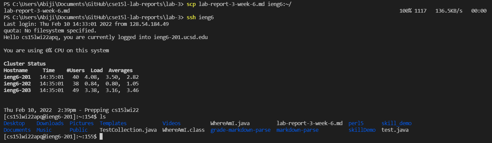

# **Lab Report #3**
## 11th Feb 2022

[List of all Lab Reports](https://abijitj.github.io/cse15l-lab-reports/)

Lab Report #3 Instructions -> [Here](https://ucsd-cse15l-w22.github.io/week/week6/)

# Streamlining `ssh` Configuration 

One way to simplify the `ssh`-ing procedure is by creating a configuration file that reduces our terminal input to log in. For example, I will change my terminal input from  `ssh cse15lwi22apq@ieng6.ucsd.edu` to `ssh ieng6`.

## Editing a `.ssh/config` file
I was able to access my `.ssh` directory in this path:\
`C:\Users\[username]\.sh `
Then, I used VSCode to edit the file in the following way. 

## Logging in to the remote server with alias
Now, I should be able to log in by simply typing in the shorter alias, `ssh ieng6`

Additionally, since I have `ssh-keygen` set up I don't have to type in my password every time. 

## SCP with alias
It is possible to run all the normal commands that was previously possible, but now with a shorter alias. For example `scp` is still possible. Below, I copied over this exact markdown file (`lab-report-3-week-6.md`) from my local computer to the remote ieng6 servers. 

It was successful!

