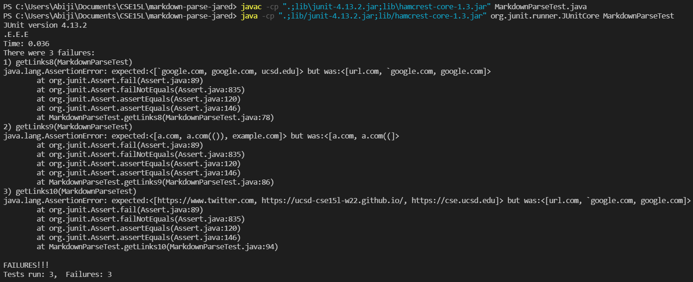
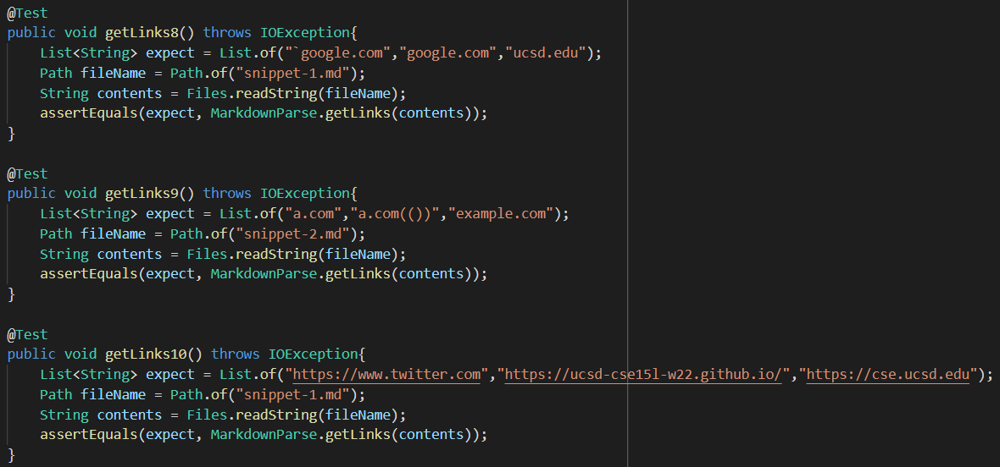
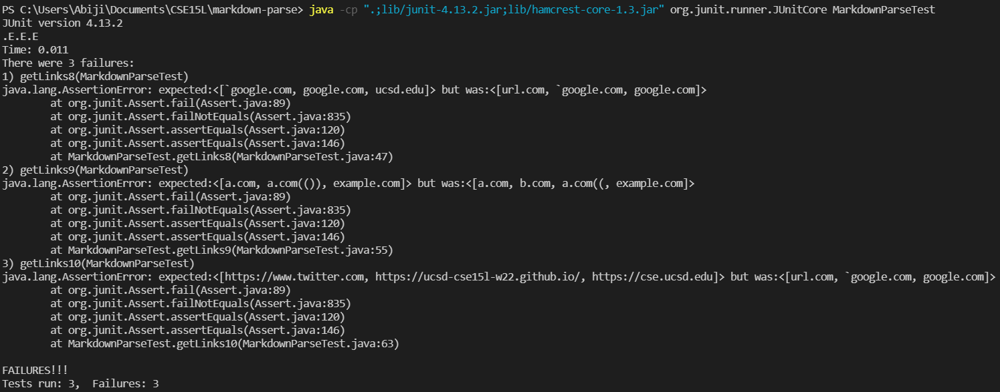

# **Lab Report #4**
## 26th Feb 2022

[List of all Lab Reports](https://abijitj.github.io/cse15l-lab-reports/)

Lab Report #4 Instructions -> [Here](https://ucsd-cse15l-w22.github.io/week/week8/)

Note: All my expected results were based on the "preview" shown by VSCode of the given markdown file. 

# Other group's program 
I ran my tests on [this repo](https://github.com/JaredJose/markdown-parse) with the given snippets. As you can see below, unfortunately, all three tests failed.

The tests that I ran are shown below. The expected values are in the String list `expect`. These same tests were run on my group's code (described in the second half of this lab report).

# My group's program 
Sadly, my group's program also failed for these tests. The results are shown below. The tests were run on [this repo](https://github.com/abijitj/my-markdown-parse). 

# Possible solutions for failed tests

Note: All of these suggestions are untested and may require some extra exploration during implementation. 

### Snippet #1:
`MarkdownParse.java` can likely be fixed within 10 lines of code. We will need to track all the backticks within the md file. If a pair of backticks encloses any portion of the [] part of a hyperlink, then it will longer be read as a link. However, if a pair of backticks encloses the () part of the hyperlink, it will continue to be read as a link. 

Also, we need to make sure that if a second closing square bracket follows the first closing square bracket before an opening parentheses, then the first closing square bracket is read as part of the hyperlink. A method like `findCloseParen` (shown in lecture) may be required (e.g:  `findCloseBracket`).  

These two changes combined will likely take more than 10 lines of code since it will probably be a good idea to create a separate method(s) to do this.

### Snippet #2:
Now, this test will likely be more involved since these scenarios may be more complicated to deal with. 

First, a nested link. This is relatively straightforward. A possible solution could be that every time we find a close bracket we check if another open bracket exists in between the previous seen open bracket and the currently discovered openBracket. In this manner, we will not miss any open brackets, and therefore nested links will be found and the overall link will be ignored. 

However, to account for escaped brackets, we need to keep track of the closest close bracket before open parentheses. Since, we will only use the content of that close bracket if it has an equivalent opening bracket. Now to keep track of these open and close brackets/parentheses, it could be useful to use a stack for parentheses matching, according to Alverado's CSE 12 Lecture from Week 4 Winter 2022. Essentially, this would work by pushing any open parentheses/brackets onto a stack, or otherwise popping off the element of a stack and comparing. If they match, then a pair does exist. And this is valid syntax. A similar strategy could be used for the parentheses within a url issue. 

This is a general explanation for a possible solution. 

## Snippet #3:
For this snippet, we essentially need to discout all content within square brackets if it contains newline characters. However, we only do the same with parentheses, if there are two or more newline characters. This can be done by searching for these characters within the square brackets and parentheses respectively. 

Thank you for reading!