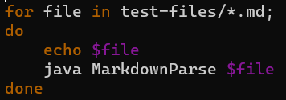
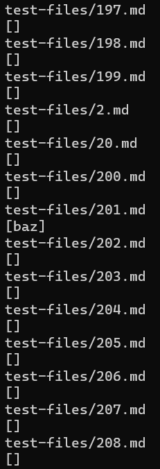
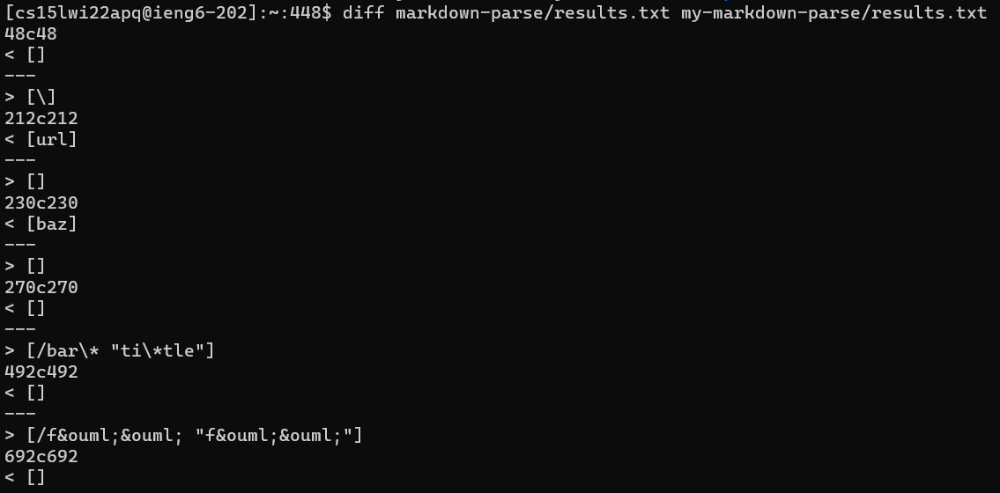
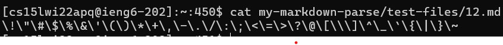
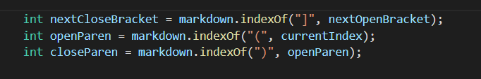
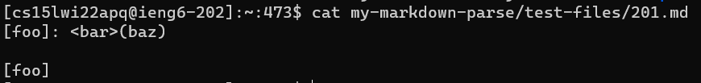
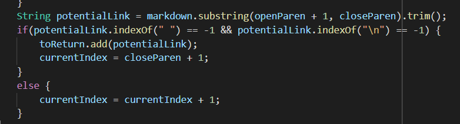

# **Lab Report #5**
## 11th March 2022

[List of all Lab Reports](https://abijitj.github.io/cse15l-lab-reports/)

Lab Report #5 Instructions -> [Here](https://ucsd-cse15l-w22.github.io/week/week10/)

# Comparison of Joe's and My Group's Repository

[Joe's repository](https://github.com/ucsd-cse15l-w22/markdown-parse) vs [My group's repository](https://github.com/abijitj/my-markdown-parse)

## Method Description
During the lab, I first edited the script.sh file found in Joe's repo in the following manner.

*Img.1: Bashscript used to run tests*

This makes it such that it loops through all the test files and for each file it prints out the name of the file and its results (the list of links). In this manner, we can run all the tests at once. Next, I used output redirection to store the results in a text file (picture shown below) by running this command: 

`bash script.sh > results.txt`. 

I conducted the same procedure on my own `MarkdownParse.java` program each stored in two different files.  

*Img.2: Screenshot of part of `results.txt` file*

Now, finally I used the `diff` command to compare these two files line by line. If there was a difference in the results, it would be highlighted. Then I could go to the relevant file to see how the results were different. 

*Img.3: Calling `diff` on the two `results.txt` files*

Now, I just manually looked at a few of the differences shown by the `diff` command. I would simply look at the appropriate line number (E.g: 48) in the `results.txt` file and look at the line just above it to find the name of the test file. In this manner, I found two different results in the two program implementation of `MarkdownParse.java`. 

## Difference #1
Looking at the first difference shown in *Img.3* on line 48, we see that (after checking line 47 of `results.txt`) the file `test-files\12.md` showed different results.

*Img.4: Test file 12*

In this case, it looks like the professor’s implementation was correct for this file since the file doesn’t seem to contain any links while mine printed out “[\]”

It appears my program seems to think that a backward slash is a link somehow. The problem may be located in the while loop that searches for the  combination. My program searches for the first open parentheses from `currentIndex` rather than `nextCloseBracket`. This would mean that likely my program sees the first set of parentheses and the '/' inside it to be the problem. Perhaps this will solve the issue. Or some other fix related to this. 

*Img.5: Possible issue with my program*

## Difference #2
The other difference I would like to show is on line 230 of `results.txt`. 

*Img.6: Test file 201*

In this test case, it appears my implementation outputted the correct result because it gave an empty result (see *Img.3*). There don’t seem to be any links in 201.md. 

It appears the professor's program does not account for a large gap between `closeBracket` and `openParen`. A possible solution could be found around here. 

*Img.7: Possible location of bug*

We could compare the index of `openParen` and `closeBracket` to make sure that there are no non-whitespace characters in between them. And only if there aren't we add the link.

That concludes the final lab of CSE15L.

Thanks for reading! Happy Spring!