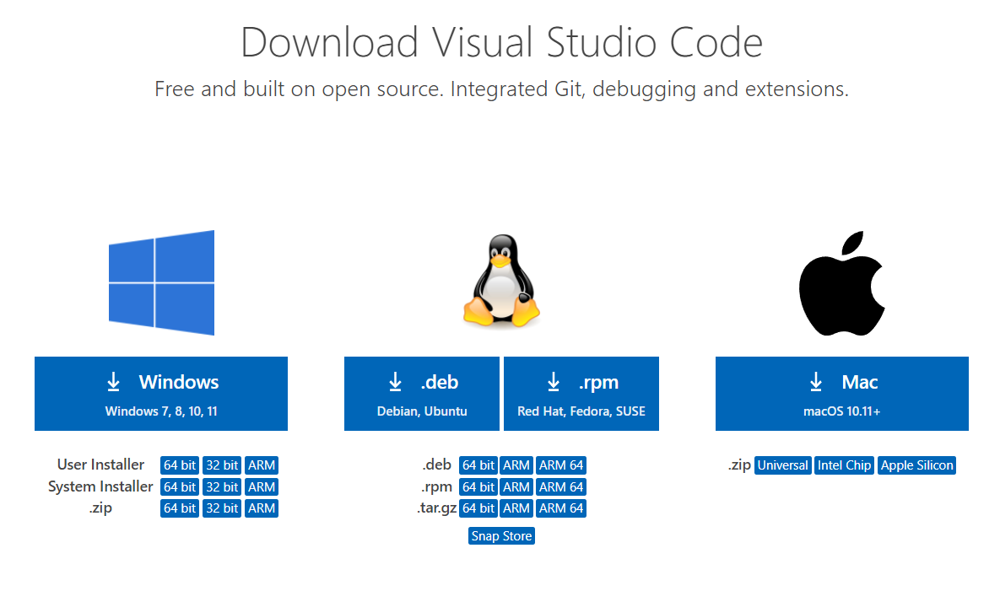

# **Lab Report #1**
## 14th Jan 2021

## **Part 1: Installing VSCode**
You can download Visual Studio Code by going to [this link](https://code.visualstudio.com/download) and downloading the appropriate version for your operating system. 

Open the downloaded .exe file and follow the given instructions to download VSCode. Now, you are set with VSCode!

## **Part 2: Remotely Connecting**
Now, comes the more interesting part. 